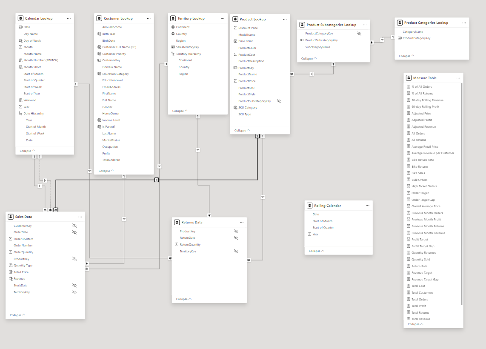
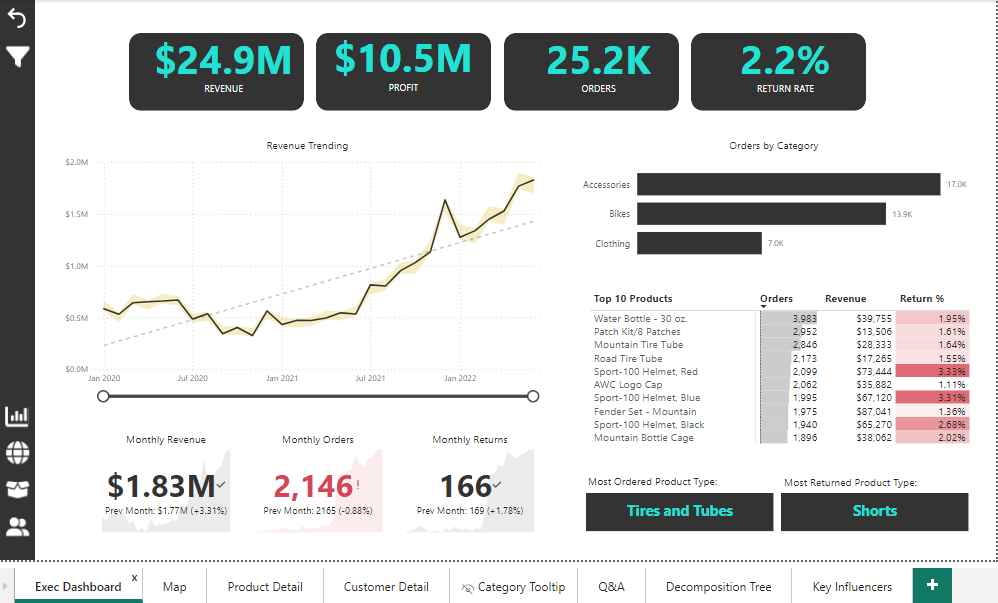
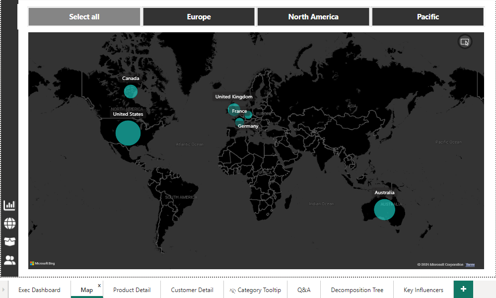
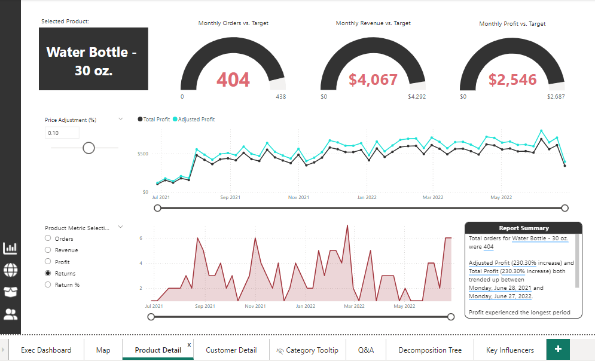
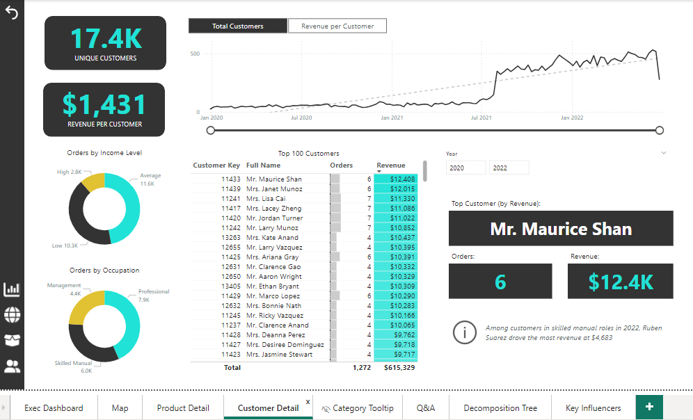
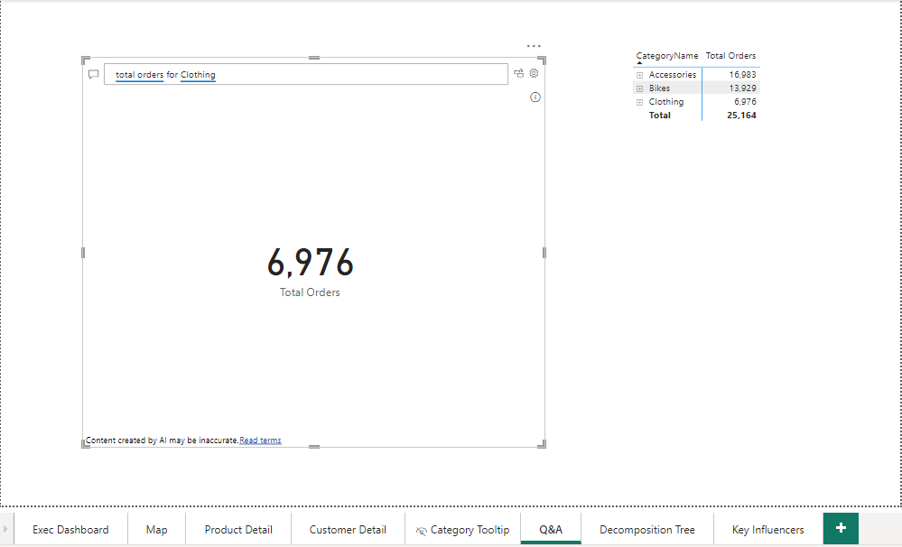
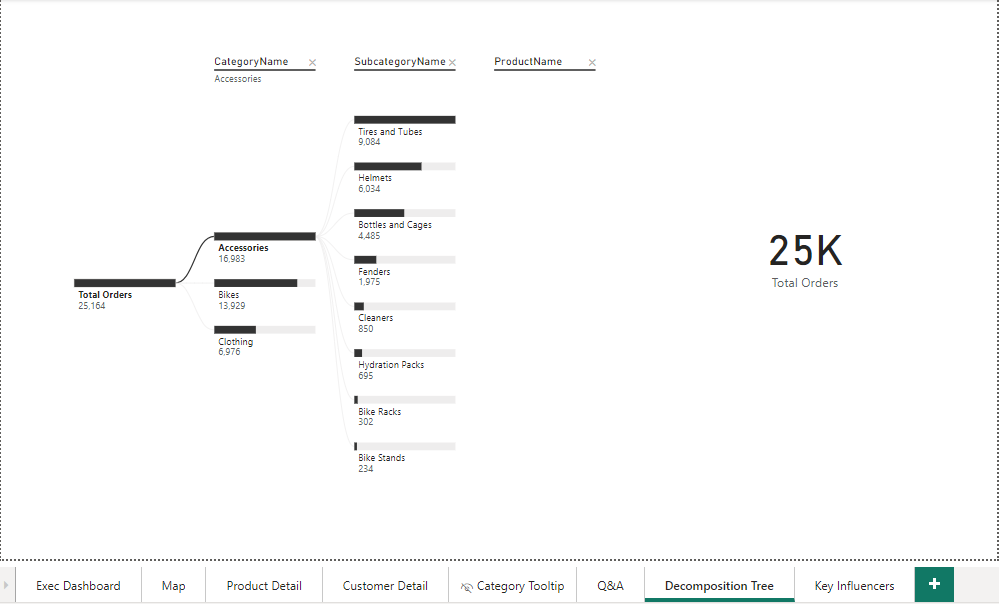
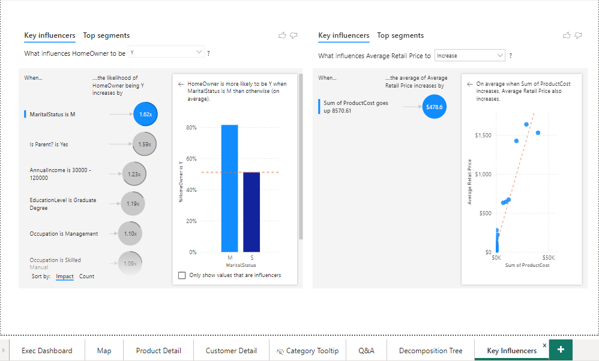

# Sales Data Analysis Project

## Objective
The objective of this project is to analyze sales data using Power BI. The analysis provides insights into sales performance, customer demographics, product categories, and returns, enabling better business decisions.

## Datasets
The data for this project was sourced from various flat files, including:
- **Sales Data:** Contains details of sales transactions.
- **Customer Lookup:** Contains customer demographic information.
- **Product Categories Lookup:** Provides product category information.
- **Product Subcategories Lookup:** Provides product subcategory information.
- **Territory Lookup:** Contains details about sales territories.
- **Calendar Lookup:** Provides date-related information for time-based analysis.
- **Returns Data:** Contains details of product returns.
- **Rolling Calendar:** Helps in rolling period calculations.

## ETL Process
The ETL (Extract, Transform, Load) process involved the following steps:
1. **Extract:** Data was extracted from multiple flat files.
2. **Transform:** Data transformation included:
   - Cleaning and formatting data.
   - Creating calculated columns and measures using DAX.
   - Merging datasets based on common keys.
   - Creating hierarchies for time-based analysis.
3. **Load:** Transformed data was loaded into Power BI for visualization.

## Data Model
The data model is designed to connect various datasets through common keys, allowing comprehensive analysis. Below is an overview of the data model:



The key tables in the data model include:
- **Calendar Lookup**
- **Customer Lookup**
- **Territory Lookup**
- **Product Categories Lookup**
- **Product Subcategories Lookup**
- **Sales Data**
- **Returns Data**
- **Rolling Calendar**
- **Measure Table**

## Measures (DAX)
Several DAX measures were created to support the analysis:
- % of All Orders
```dax
% of All Orders = 
DIVIDE(
    [Total Orders], 
    [All Orders]
)
  ```
- % of All Returns
```dax
% of All Returns = 
DIVIDE(
    [Total Returns],
    [All Returns]
)
```
- 10 Day Rolling Revenue
```dax
10-day Rolling Revenue = 
CALCULATE(
    [Total Revenue],
    DATESINPERIOD(
        'Calendar Lookup'[Date],
        MAX(
            'Calendar Lookup'[Date]
        ),
        -10,
        DAY
    )
)
```
- 90 Day Rolling Profit
```dax
90-day Rolling Profit = 
CALCULATE(
    [Total Profit],
    DATESINPERIOD(
        'Calendar Lookup'[Date],
        LASTDATE(
            'Calendar Lookup'[Date]
        ),
        -90,
        DAY
    )
)
```
- Adjusted Price
```dax
Adjusted Price = [Average Retail Price] * (1 + 'Price Adjustment (%)'[Price Adjustment (%) Value])
```
- Adjusted Profit
```dax
Adjusted Profit = 
[Adjusted Revenue] - [Total Cost]
```
- Adjusted Revenue
```dax
Adjusted Revenue = 
SUMX(
    'Sales Data',
    'Sales Data'[OrderQuantity]
    *
   [Adjusted Price])
```
- All Orders
```dax
All Orders = 
CALCULATE(
    [Total Orders], 
    ALL(
        'Sales Data'
    )
)
```
- All Returns
```dax
All Returns = 
CALCULATE(
    [Total Returns],
    ALL(
        'Returns Data'
    )
)
```
- Average Retail Price
```dax
Average Retail Price = 
AVERAGE(
    'Product Lookup'[ProductPrice]
)
```
- Average Revenue per Customer
```dax
Average Revenue per Customer = 
DIVIDE(
    [Total Revenue], 
    [Total Customers]
)
```
- Bike Return Rate
```dax
Bike Return Rate = 
CALCULATE(
    [Return Rate],
    'Product Categories Lookup'[CategoryName] = "Bikes"
)
```
- Bike Returns
```dax
Bike Returns = 
CALCULATE(
    [Quantity Returned],
    'Product Categories Lookup'[CategoryName] = "Bikes"
)
```

- Bike Sales
```dax
Bike Sales = 
CALCULATE(
    [Quantity Sold],
    'Product Categories Lookup'[CategoryName] = "Bikes"
)
```
- Bulk Orders
```dax
Bulk Orders = 
CALCULATE(
    [Total Orders],
    'Sales Data'[OrderQuantity] > 1
)
```

- High Ticket Orders
```dax
High Ticket Orders = 
CALCULATE(
    [Total Orders],
    FILTER(
        'Product Lookup',
        'Product Lookup'[ProductPrice] > [Overall Average Price]
    )
)
```
- Order Target
```dax
Order Target = 
[Previous Month Orders] * 1.1
```
- Order Target Gap
```dax
Order Target Gap = [Total Orders] - [Order Target]
```
- Overall Average Price
```dax
Overall Average Price = 
CALCULATE(
    [Average Retail Price],
    ALL(
        'Product Lookup'
    )
)
```
- Previous Month Orders
```dax
Previous Month Orders = 
CALCULATE(
    [Total Orders],
    DATEADD(
        'Calendar Lookup'[Date],
        -1,
        MONTH
    )
)
```
- Previous Month Profit
```dax
Previous Month Profit = 
CALCULATE(
    [Total Profit],
    DATEADD(
        'Calendar Lookup'[Date],
        -1,
        MONTH
    )
)
```
- Previous Month Returns
```dax
Previous Month Returns = 
CALCULATE(
    [Total Returns],
    DATEADD(
        'Calendar Lookup'[Date],
        -1,
        MONTH
    )
)
```
- Previous Month Revenue
```dax
Previous Month Revenue = 
CALCULATE(
    [Total Revenue],
    DATEADD(
        'Calendar Lookup'[Date],
        -1,
        MONTH
    )
)
```
- Profit Target
```dax
Profit Target = 
[Previous Month Profit] * 1.1
```
- Profit Target Gap
```dax
Profit Target Gap = [Total Profit] - [Profit Target]
```
- Quantity Returned
```dax
Quantity Returned = 
SUM(
    'Returns Data'[ReturnQuantity]
)
```
- Quantity Sold 
```dax
Quantity Sold = 
SUM(
    'Sales Data'[OrderQuantity]
)
```
- Return Rate
```dax
Return Rate = 
DIVIDE(
    [Quantity Returned],
    [Quantity Sold],
    "No Sales"
)
```
- Revenue Target
```dax
Revenue Target = 
[Previous Month Revenue] * 1.1
```
- Revenue Target Gap
```dax
Revenue Target Gap = [Total Revenue] - [Revenue Target]
```
- Total Cost
```dax
Total Cost = 
SUMX(
    'Sales Data',
    'Sales Data'[OrderQuantity]
    *
    RELATED(
        'Product Lookup'[ProductCost]
    )
)
```
- Total Customers
```dax
Total Customers = 
DISTINCTCOUNT(
    'Sales Data'[CustomerKey]
)
```
- Total Orders
```dax
Total Orders = 
DISTINCTCOUNT(
    'Sales Data'[OrderNumber]
)
```
- Total Profit
```dax
Total Profit = 
[Total Revenue] - [Total Cost]
```
- Total Returns
```dax
Total Returns = 
COUNT(
    'Returns Data'[ReturnQuantity]
)
```

- Total Revenue
```dax
Total Revenue = 
SUMX(
    'Sales Data',
    'Sales Data'[OrderQuantity]
    *
    RELATED(
        'Product Lookup'[ProductPrice]
    )
)
```
- Weekend Orders
```dax
Weekend Orders = 
CALCULATE(
    [Total Orders],
    'Calendar Lookup'[Weekend] = "Weekend"
)
```
- YTD Revenue
```dax
YTD Revenue = 
CALCULATE(
    [Total Revenue],
    DATESYTD(
        'Calendar Lookup'[Date]
    )
) 
```

## Dashboards
The project includes several dashboards to visualize the insights derived from the data. Key dashboards cover:
Here's a description for your Executive Dashboard based on the provided image:


### Executive Dashboard


The Executive Dashboard provides a comprehensive overview of the key performance metrics for sales and returns. It includes essential KPIs, trends, and detailed breakdowns of product performance and categories.

#### Key Performance Indicators (KPIs)
- **Revenue:** $24.9M
- **Profit:** $10.5M
- **Orders:** 25.2K
- **Return Rate:** 2.2%

#### Diagrams and Visualizations
1. **Revenue Trending**
   - **Type:** Line Chart
   - **Description:** This line chart shows the trend in revenue from January 2020 to the present. It highlights the growth pattern and significant peaks in revenue.
   - **X-axis:** Time (Months)
   - **Y-axis:** Revenue in Millions

2. **Orders by Category**
   - **Type:** Bar Chart
   - **Description:** This bar chart displays the number of orders across different product categories, such as Accessories, Bikes, and Clothing.
   - **Categories:**
     - Accessories: 17.0K orders
     - Bikes: 13.9K orders
     - Clothing: 7.0K orders

3. **Top 10 Products**
   - **Type:** Table
   - **Description:** A table listing the top 10 products based on orders. It includes columns for product names, the number of orders, total revenue, and return percentage.
   - **Columns:**
     - Product Name
     - Orders
     - Revenue
     - Return Percentage

4. **Monthly Metrics**
   - **Monthly Revenue:** $1.83M (Previous Month: $1.77M, +3.31%)
   - **Monthly Orders:** 2,146 (Previous Month: 2,165, -0.88%)
   - **Monthly Returns:** 166 (Previous Month: 169, -1.78%)

#### Additional Metrics
- **Most Ordered Product Type:** Tires and Tubes
- **Most Returned Product Type:** Shorts

#### Slicers
- **Time Range Slicer:** Allows users to adjust the time period for the revenue trending chart.
- **Category Slicer:** Enables filtering data based on product categories.
- **Product Type Slicer:** Provides the option to filter by product types.





### Map Dashboard

The Map Dashboard provides a geographical visualization of sales data, highlighting the performance in different regions across the globe. It allows for an easy comparison of sales metrics across various countries and continents.

#### Geographical Visualization
1. **World Map**
   - **Type:** Filled Map (Bubble Map)
   - **Description:** This map shows the geographical distribution of sales with bubble sizes representing the volume of sales in each country. The larger the bubble, the higher the sales volume.
   - **Countries Highlighted:**
     - United States
     - Canada
     - United Kingdom
     - France
     - Germany
     - Australia

#### Slicers
- **Region Selectors:**
  - **Select All:** Displays data for all regions.
  - **Europe:** Filters the map to show data for European countries.
  - **North America:** Filters the map to show data for North American countries.
  - **Pacific:** Filters the map to show data for countries in the Pacific region.

#### Interaction
- **Zoom and Pan:** Users can zoom in and out and pan across the map to focus on specific regions.
- **Hover Tooltips:** Hovering over a country bubble provides detailed information about the sales in that country.

#### Insights
- **United States:** Shows the largest bubble indicating the highest sales volume.
- **Canada, United Kingdom, France, Germany, Australia:** Other significant markets with substantial sales volumes.





### Product Dashboard


The Product Dashboard provides detailed analysis and performance metrics for individual products. This example focuses on the "Water Bottle - 30 oz." product, showcasing various performance indicators and trends.

#### Key Performance Indicators (KPIs)
- **Monthly Orders vs. Target:** 404 orders (Target: 438 orders)
- **Monthly Revenue vs. Target:** $4,067 (Target: $4,292)
- **Monthly Profit vs. Target:** $2,546 (Target: $2,687)

#### Diagrams and Visualizations
1. **Selected Product**
   - **Type:** Text Box
   - **Description:** Displays the name of the selected product ("Water Bottle - 30 oz.").

2. **Price Adjustment**
   - **Type:** Slider
   - **Description:** Allows users to adjust the price of the selected product to see the impact on profit and revenue. Current adjustment: 0.10%.

3. **Total Profit and Adjusted Profit**
   - **Type:** Line Chart
   - **Description:** Shows the trend in total profit and adjusted profit over time. This line chart helps in understanding the profitability trend and the effect of price adjustments.
   - **X-axis:** Time (Months)
   - **Y-axis:** Profit in Dollars
   - **Legend:**
     - Total Profit (Black Line)
     - Adjusted Profit (Green Line)

4. **Monthly Orders vs. Target**
   - **Type:** Gauge
   - **Description:** Displays the number of orders for the selected product against the target orders.

5. **Monthly Revenue vs. Target**
   - **Type:** Gauge
   - **Description:** Displays the revenue for the selected product against the target revenue.

6. **Monthly Profit vs. Target**
   - **Type:** Gauge
   - **Description:** Displays the profit for the selected product against the target profit.

7. **Product Metric Selector**
   - **Type:** Dropdown
   - **Description:** Allows users to select different metrics for analysis. Available options:
     - Orders
     - Revenue
     - Profit
     - Returns
     - Return Percentage

8. **Returns and Return Percentage**
   - **Type:** Area Chart
   - **Description:** Shows the trend in returns and return percentage over time. This helps in analyzing the return behavior of the product.
   - **X-axis:** Time (Months)
   - **Y-axis:** Returns Count / Return Percentage

#### Report Summary
- **Summary Box:** Provides a textual summary of the performance of the selected product.
  - **Total Orders:** 404
  - **Adjusted Profit:** Increased by 230.30%
  - **Total Profit:** Increased by 230.30%
  - **Trend Period:** Notable trend from June 28, 2021, to June 27, 2022
  - **Longest Period:** Profit experienced the longest period of growth

#### Interaction
- **Time Range Slicer:** Users can adjust the time period to see historical performance.
- **Product Metric Selector:** Allows users to switch between different performance metrics for analysis.
- **Price Adjustment Slider:** Enables users to simulate price changes and their impact on profit.





### Customer Dashboard


The Customer Dashboard provides detailed insights into customer behavior and performance metrics. It highlights key customer statistics, such as the number of unique customers, revenue per customer, and a detailed view of the top customers by orders and revenue.

#### Key Performance Indicators (KPIs)
- **Unique Customers:** 17.4K
- **Revenue per Customer:** $1,431

#### Diagrams and Visualizations
1. **Total Customers and Revenue per Customer**
   - **Type:** Line Chart
   - **Description:** Displays the trend in the total number of customers and the average revenue per customer over time.
   - **X-axis:** Time (Months)
   - **Y-axis:** Count of Customers / Revenue in Dollars
   - **Legend:**
     - Total Customers (Black Line)
     - Revenue per Customer (Gray Line)

2. **Orders by Income Level**
   - **Type:** Donut Chart
   - **Description:** Shows the distribution of orders across different income levels.
   - **Segments:**
     - High Income: 2.8K orders
     - Average Income: 11.6K orders
     - Low Income: 10.3K orders

3. **Orders by Occupation**
   - **Type:** Donut Chart
   - **Description:** Illustrates the distribution of orders based on customer occupations.
   - **Segments:**
     - Management: 4.4K orders
     - Professional: 7.9K orders
     - Skilled Manual: 6.0K orders

4. **Top 100 Customers**
   - **Type:** Table
   - **Description:** Lists the top 100 customers based on the number of orders and total revenue generated.
   - **Columns:**
     - Customer Key
     - Full Name
     - Orders
     - Revenue

5. **Top Customer by Revenue**
   - **Type:** Card
   - **Description:** Highlights the top customer by revenue. For this period, the top customer is Mr. Maurice Shan.
   - **Details:**
     - **Name:** Mr. Maurice Shan
     - **Orders:** 6
     - **Revenue:** $12.4K

#### Additional Metrics
- **Customer Key:** Identifies the customer.
- **Year Selector:** Allows users to filter data by year (e.g., 2020, 2022).
- **Report Summary:** Provides insights and observations, such as:
  - "Among customers in skilled manual roles in 2022, Ruben Suarez drove the most revenue at $4,683."

#### Interaction
- **Time Range Slicer:** Allows users to adjust the time period for the customer trend analysis.
- **Year Selector:** Filters the data to show metrics for specific years.
- **Hover Tooltips:** Provides detailed information when hovering over chart elements.




### Q&A Dashboard

#### Overview
The Q&A Dashboard leverages the natural language query capability in Power BI to provide instant answers to specific questions related to the dataset. Users can type in their queries, and the dashboard dynamically generates visualizations based on the responses.

#### Key Feature
- **Natural Language Query:** Allows users to ask questions in plain English and receive immediate visual answers. 

#### Example Query and Visualization
1. **Query:**
   - **Question:** "Total orders for Clothing"
   - **Answer:** The dashboard displays the total number of orders for the clothing category.
   - **Result:** 6,976 Total Orders

2. **Visualization Type:**
   - **Type:** Card
   - **Description:** A large card displaying the total number of orders for the queried category.

3. **Category Breakdown:**
   - **Type:** Table
   - **Description:** A table providing a breakdown of total orders by category for comparison.
   - **Columns:**
     - **Category Name**
     - **Total Orders**
   - **Categories Included:**
     - Accessories: 16,983 orders
     - Bikes: 13,929 orders
     - Clothing: 6,976 orders
     - **Total:** 25,164 orders

#### Interaction
- **Q&A Text Box:** Users can type their queries directly into the text box. The Power BI engine interprets the question and generates an appropriate visual response.
- **Real-Time Updates:** The visualization updates in real-time based on the user's input, providing a flexible and interactive data exploration experience.

#### Insights Provided
- **Instant Answers:** Quickly retrieve specific information without navigating through multiple dashboards.
- **User-Friendly:** Simplifies data interaction, making it accessible even to users who may not be familiar with complex data queries or analysis techniques.




### Decomposition Tree Dashboard


The Decomposition Tree Dashboard is a powerful analytical tool that breaks down a primary metric into its contributing factors, providing a hierarchical view of data. In this dashboard, the total number of orders is decomposed by category, subcategory, and product name to reveal deeper insights into sales performance.



### Key Influencers Dashboard

The Key Influencers Dashboard provides insights into the factors that significantly impact specific outcomes or metrics. It helps identify and visualize the key drivers behind certain behaviors or performance indicators, allowing for more informed decision-making.




## Final Dashboard


## Summary
The Sales Data Analysis project has successfully provided valuable insights into the performance of sales across various dimensions, including products, customers, and geographical regions. By leveraging Power BI's powerful visualization and analytical capabilities, we have created a comprehensive suite of dashboards that enable data-driven decision-making and strategic planning.

### Key Findings
1. **Executive Insights:**
   - Total revenue of $24.9M and a profit of $10.5M with a return rate of 2.2%.
   - The highest order volumes were observed in the Accessories category, followed by Bikes and Clothing.

2. **Geographical Distribution:**
   - Significant sales volumes in key markets such as the United States, Canada, United Kingdom, France, Germany, and Australia.
   - Regional performance variations highlight opportunities for targeted marketing and sales strategies.

3. **Product Performance:**
   - Detailed analysis of individual products, with the Water Bottle - 30 oz. identified as a top performer.
   - Adjusted profit metrics indicate the impact of pricing strategies on profitability.

4. **Customer Analysis:**
   - A diverse customer base with 17.4K unique customers generating an average revenue of $1,431 per customer.
   - Identification of top customers and segments with higher engagement and revenue contributions.

5. **Detailed Metrics and Trends:**
   - Decomposition tree analysis provided a hierarchical view of order distribution, revealing key contributors to sales.
   - Key influencers identified critical factors driving customer behaviors and product pricing.

## Recommendations
1. **Strategic Focus:**
   - Concentrate marketing efforts on high-performing regions and customer segments.
   - Enhance product offerings and promotions for top-selling and high-margin products.

2. **Customer Engagement:**
   - Develop targeted campaigns for customer segments with high revenue potential.
   - Implement loyalty programs to retain top customers and increase repeat purchases.

3. **Operational Improvements:**
   - Monitor and optimize return rates by analyzing the reasons for returns and addressing product quality issues.
   - Refine pricing strategies based on the insights from adjusted profit and cost analysis.

## Future Work
1. **Dynamic Updates:**
   - Integrate real-time data feeds to keep the dashboards updated with the latest sales information.
   - Continuously refine and expand the datasets to include more dimensions and metrics.

2. **Advanced Analytics:**
   - Implement predictive analytics models to forecast sales trends and customer behaviors.
   - Explore machine learning techniques to uncover deeper insights and automate decision-making processes.

## Conclusion
The Sales Data Analysis project has demonstrated the power of data visualization and analytics in uncovering actionable insights. By utilizing Power BI, we have created an interactive and user-friendly platform for exploring sales data, identifying key trends, and making informed business decisions. This project sets a strong foundation for ongoing analytics efforts and continuous improvement in sales performance and customer satisfaction.

